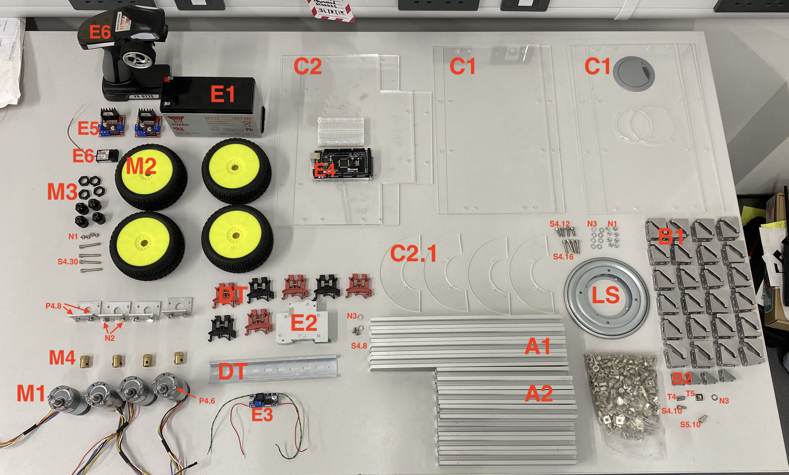

# Building the OpenScout robot with 'lazy Susan' revolute hinge
This configuration uses four-wheel differential drive steering, and a Lazy Susan hinged body which enables the wheels to drive over small obstacles without the need for suspension.

## Total Build time = 390 minutes (6 hours 30 minutes)

## Assembly Tools Required
These are the tools required to build the OpenScout

| Material                         | Quantity | UK link |
| ---------------------------------|---------:|:-------:|
| M2/3/4/5 Hex Key | 1 | [Link](https://www.amazon.co.uk/ZISHATUO-Hex-Key-Set-2mm-5mm/dp/B09H768WYX/ref=pb_allspark_dp_sims_pao_desktop_session_based_sccl_2/258-5239920-8165609?pd_rd_w=kzaV3&pf_rd_p=0b4a59e4-200b-45ea-a783-524e7e41dc2f&pf_rd_r=RD0QHGDWYM9XFNKMBHKS&pd_rd_r=8dc6d3ba-93f0-4fe6-a26c-0d9a4fdacbea&pd_rd_wg=EEpUo&pd_rd_i=B09H768WYX&psc=1) |
| Small Flathead Screwdriver | 1 | [Link](https://www.amazon.co.uk/Rolson-28852-Screwdriver-Set-Pieces/dp/B00OOTPM6K/ref=sr_1_21?crid=BQBSM3K5OGBA&keywords=small%2BPhil%3Blips%2Bhead%2Bscrewdriver&qid=1649287786&s=diy&sprefix=small%2Bphil%2Blips%2Bhead%2Bscrewdriver%2Cdiy%2C107&sr=1-21&th=1) |
| Small Phillips Head Screwdriver | 1 | [Link](https://www.amazon.co.uk/Rolson-28852-Screwdriver-Set-Pieces/dp/B00OOTPM6K/ref=sr_1_21?crid=BQBSM3K5OGBA&keywords=small%2BPhil%3Blips%2Bhead%2Bscrewdriver&qid=1649287786&s=diy&sprefix=small%2Bphil%2Blips%2Bhead%2Bscrewdriver%2Cdiy%2C107&sr=1-21&th=1) |
| 100mm Steel rule | 1 | [Link](https://www.amazon.co.uk/Silverline-MT65-Steel-Rule-150/dp/B000LFXRNQ/ref=sr_1_5?crid=3H7ZUITKEPZYU&keywords=100mm+metal+ruler&qid=1649287876&s=diy&sprefix=100mm+metal+rule%2Cdiy%2C128&sr=1-5) |

## Bill of materials
Before proceeding make sure you do have all the following materials. You are encouraged to read carefully the tutorial before starting building the robot.

For the chassis:
| Material                         | Quantity | Reference | UK link |
| ---------------------------------|---------:|:---------:|:-------:|
| 300mm 20x20 aluminium extrusion  | 8 |  A1 | [Link](https://ooznest.co.uk/product/v-slot-linear-rail-20x20mm-cut-to-size/) |
| 200mm 20x20 aluminium extrusion  | 17 | A2 | [Link](https://ooznest.co.uk/product/v-slot-linear-rail-20x20mm-cut-to-size/) |
| 20x20 Angle Joint Brace Brackets | 48 | B1 | [Link](https://amz.run/5TF6) |
| 90 Degree Cast Corner | 8 | B2 | [Link](https://ooznest.co.uk/product/90-degree-cast-corner/) |
| 200x340x3mm acrylic sheets | 4 | C1 | [Link](https://www.acrylicsheetcuttosize.co.uk/product/clear-acrylic-sheet/) |
| 240x340x3mm acrylic sheets | 2 | C2 | [Link](https://www.acrylicsheetcuttosize.co.uk/product/clear-acrylic-sheet/) |
| Lazy Susan 5.5in | 1 | LS | [Link](https://amz.run/5TF8) |
| Din rail with terminal blocks | 1 | DT | [Link](https://amz.run/5TFF) |
| Velcro 50mmx1m | 1 | Q | [Link](https://amz.run/5TFP) |
| 90:1 12V motor with encoders | 4 | M1 | [Link](https://amz.run/5TFQ) |
| Wheels (112x46mm) | 4 | M2 | [Link](https://www.amazon.co.uk/best-rubber-hexagon-offroad-crawler/dp/B08B16VQTZ/ref=sr_1_6?keywords=1%2F8+buggy+wheels&qid=1656370202&sr=8-6) |
| Wheel Hex Driver 12mm to 17mm | 4 | M3 | [Link](shorturl.at/axT25) |
| Hex coupler 6mm   | 4 | M4 | [Link](https://amz.run/5TFT) |

For the electronics:
| Material                         | Quantity | Reference | UK link |
| ---------------------------------|---------:|:---------:|:-------:|
| 12V Lead Acid battery | 1 | E1 | [Link](https://uk.rs-online.com/web/p/lead-acid-batteries/0597835) |
| 10A circuit breaker | 1 | E2 | [Link](https://amz.run/5TFI) |
| Buck converter | 1 | E3 | [Link](https://amz.run/5TFJ) |
| Arduino Mega | 1 | E4 | [Link](https://amz.run/5TFL) |
| L298N Motor drivers | 2 | E5 | [Link](https://amz.run/5TFN) |
| Radio transmitter-receiver | 1 | E6 | [Link](https://amz.run/5TFO) |
| Breadboards | - | - | - |
| Wires | - | - | - |

Bolts & nuts:
| Material                         | Quantity | Reference | UK link |
| ---------------------------------|---------:|:---------:|:-------:|
| Sems screw 6mm (More info needed) | 16 | P4.6 | - |
| Sems screw 8mm (More info needed) | 8 | P4.8 | - |
| M4 8mm socket screw | 2 | S4.8 | - |
| M4 10mm socket screw | 8 | S4.10 | - |
| M4 12mm socket screw (More info needed) | 4 | S4.12 | - |
| M4 16mm socket screw (More info needed) | 4 | S4.16  | - |
| M4 30mm socket screw | 4 | S4.30 | - |
| M5 10mm socket screw | 144 | S5.10 | - |
| M4 T-slot nuts | 10 | T4 | - |
| M5 T-slot nuts | 144 | T5 | - |
| M4 Hex nuts | 12 | N1 | - |
| M4 Hammer nuts (More info needed)| 8 | N2 | - |
| M5 Washers | 170 | N3 | - |

  

(**NOTE**: The links provided only as examples and there is no affiliation with the suppliers. The reader is advised to look for cheaper alternatives if possible. The motor brackets are provided in the CQRobot motor package, thus they are not in the bill of materials. Please keep in mind that alternative motors, brackets or components might require different bolts or additional parts.)

## Assembly instructions
This tutorial consists of 7 parts for constructing the robot platform with the hinge in the middle. It is necessary to be followed in the given order. After finishing the assembly, the robot is ready to be flashed with firmware!

Parts:
1. [Front compartment](./front_compartment.md)
2. [Back compartment](./back_compartment.md)
3. [Connecting the two compartments with the hinge](./hinge.md)
4. [Adding the acrylic panels](./acrylic_panels.md)
5. [Din rail](./din_rail.md)
6. [Attaching the motors and the wheels](./motors_and_wheels.md)
7. [Adding the electronics](./circuit_assembly_instructions.md)

## Adding the software
[Add the PID controller to the Arduino](../../Software/README.md)

## Speed PID controller calibration
[Speed PID controller calibration](./pid_calibration.md)
