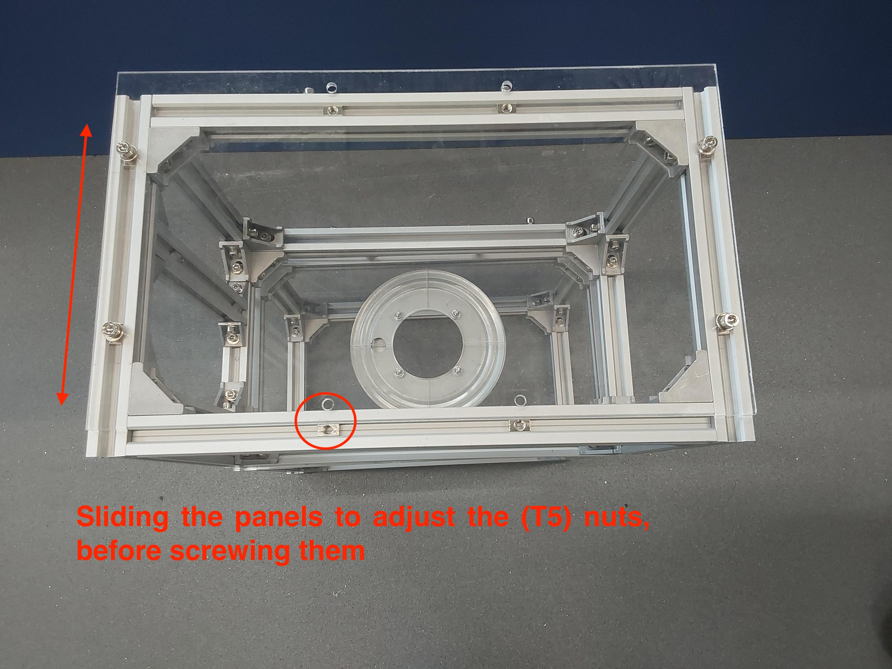
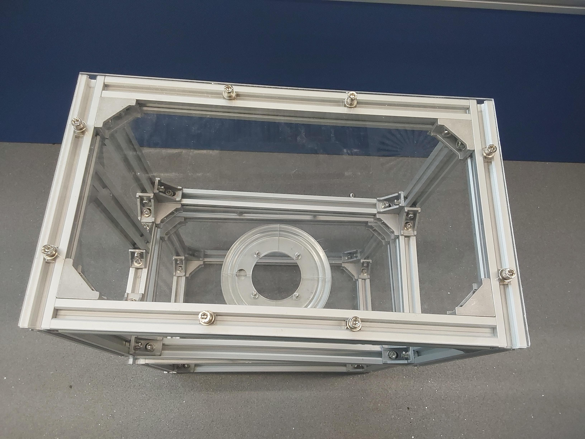
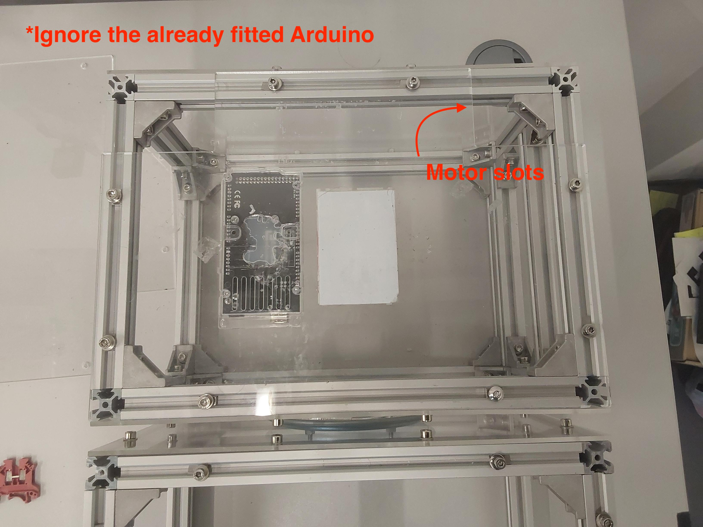

# Acrylic panels

## Build time = 20 minutes

### Bill of materials:

| Material                         | Quantity | Reference | UK link |
| ---------------------------------|---------:|:---------:|:-------:|
| 200x340x3mm acrylic sheets | 4 | C1 | [Link](https://www.acrylicsheetcuttosize.co.uk/product/clear-acrylic-sheet/) |
| 240x340x3mm acrylic sheets | 2 | C2 | [Link](https://www.acrylicsheetcuttosize.co.uk/product/clear-acrylic-sheet/) |

## Introduction

This tutorial includes instructions to laser-cut and fit the bare minimum acrylic panels needed on the robot. That is on the bottom, front and back side of the robot; in the previous tutorial, 2 sheets also were added in the middle as the hinge is attached on them. The reason is to keep the cost to the minimum, however the 3mm is not that strong as it should. You are welcome to use 5mm acrylic sheets, something stronger, or even wood to take full advantage of the maximum robot's payload.

## Step-by-step instructions

1. TODO: 
 - how to laser cut the bottom, front and back panels.
 - Upload the .dxf files in the `Documentation/CAD_Files` folder
 - Update the `Documentation/CAD_Files/README.md`

2. Fit the side panels (the smaller ones) as in the previous tutorial using the already equipped (S5.10) screws. (**HINT**: Fit first two opposing sides, and slide the panel across the extrusion, so you can align the misaligned (T5) nuts.)

  
  

3. Fit the bottom panels (the bigger ones) as in the previous step using the already equipped (S5.10) screws. The motor slots should be facing away from the middle. Repeat for each half of the construction. Make sure the construction is solid before progressing.

  

## What's next?

Follow the [din rail](./din_rail.md) tutorial to connect the front and the back compartment.
