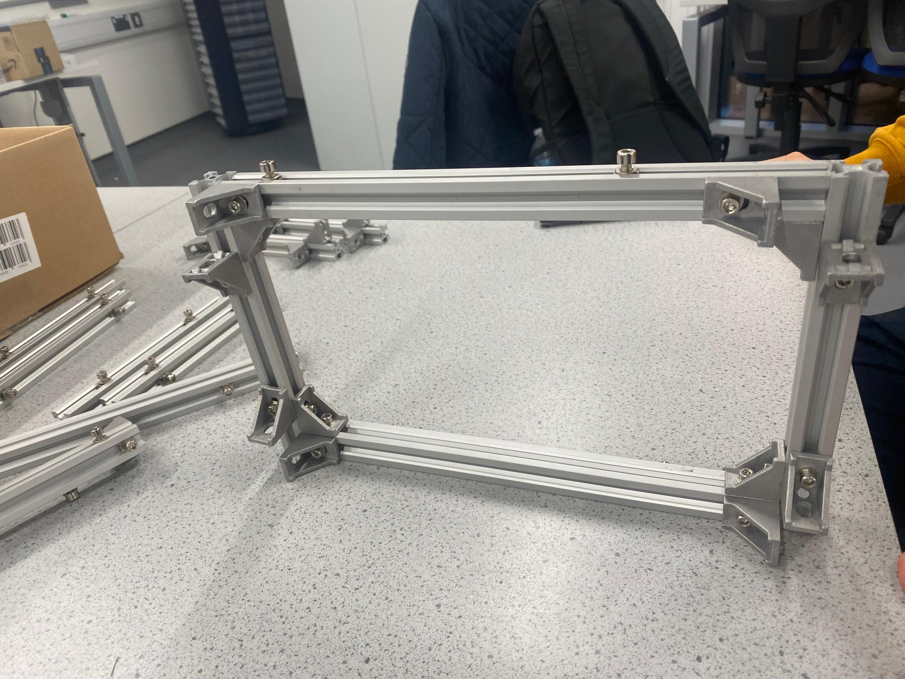
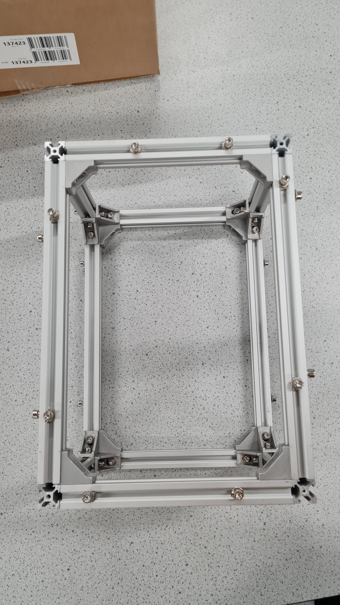

# 2024 Method for Assembling the System

## Step-by-step instructions

### Step 1

  

  

  

  

### Step 2

  

  

  

### Step 3

  

  

  

  

### Step 4

  

  

### Step 5

  

  

  

  

## Wiring Diagram

1. See the [Simplified System Schematic](../../Documentation/Schematics/simplified_system_layout_2024.pdf) schematic for reference.

  

2. See the [Full System Schematic](../../Documentation/Schematics/full_system_layout_2024.pdf) schematic for reference.

  

## OpenScout driving

https://github.com/user-attachments/assets/b3fbb942-297d-4cb1-b123-8d51ed27b225

## What's next?
Congratulations! The robot wiring is complete. Follow the last part of the tutorial series to [flash the software](../../Software/README.md).
