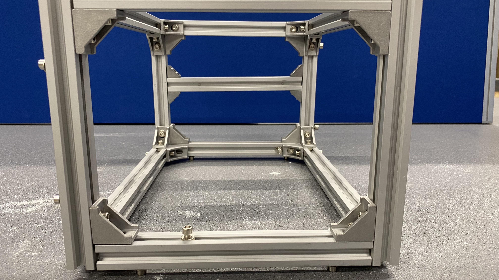

# Back Compartment

## Build time = 90 minutes

### Bill of materials:

| Material                         | Quantity | Reference | UK link |
| ---------------------------------|---------:|:---------:|:-------:|
| 300mm 20x20 aluminium extrusion  | 4 |  A1 | [Link](https://ooznest.co.uk/product/v-slot-linear-rail-20x20mm-cut-to-size/) |
| 200mm 20x20 aluminium extrusion  | 9 | A2 | [Link](https://ooznest.co.uk/product/v-slot-linear-rail-20x20mm-cut-to-size/) |
| 20x20 Angle Joint Brace Brackets | 24 | B1 | [Link](https://amz.run/5TF6) |
| 90 Degree Cast Corner | 8 | B2 | [Link](https://ooznest.co.uk/product/90-degree-cast-corner/) |
| M4 10mm socket screw | 8 | S4.10 | - |
| M5 10mm socket screw | 72 | S5.10 | - |
| M4 T-slot nuts | 8 | T4 | - |
| M5 T-slot nuts | 72 | T5 | - |
| M5 Washers | 80 | N3 | - |

## Introduction

The back compartment consists of a boxed-shaped construction which is almost identical to the front compartment. Its key difference is that it makes use of one extra (A2) extrusion on the right side of the box, to accommodate the din-rail which will be introduced later on. Also, the (A2) extrusion is fitted and attached using M4 (T4), (S4.10) nuts and screw with slightly smaller (B2) 90 degree joint brackets. The (T4) nut, does not need to be fitted through the open-ended (A2), instead it can be fitted in-place and fasting a screw on it will secure it (The fact that is fitted in-place though can be a bit tricky to properly secure it.)

## Step-by-step instructions

1. Duplicate the front compartment by following the previous tutorial ([front compartment](./front_compartment.md)) up to step 7, before fully connecting the two frames together. Ensure that the frame is constructed at the corners correctly and that the assembled parts look as in the following picture:

  

2. Attach 2 (B2) joints on each side on the spare (A2) extrusion on the right side of the compartment using the M4 parts. The (T4) nut can be fitted in-place, however adjusting it can be tricky. Try to align it an make it look as in the following picture. Screwing it tightly will hold it in-place as it rotates within the (A2).

3. Attach the piece prepared in the previous step on the construction. (Hint: A smaller allen key might help the ones with not so delicate hands.)

  
  
  

4. Fit the two frames together and tight the bolts together.

  

## What's next?
Follow the [lazy susan hinge](./hinge.md) tutorial to connect the front and the back compartment.
