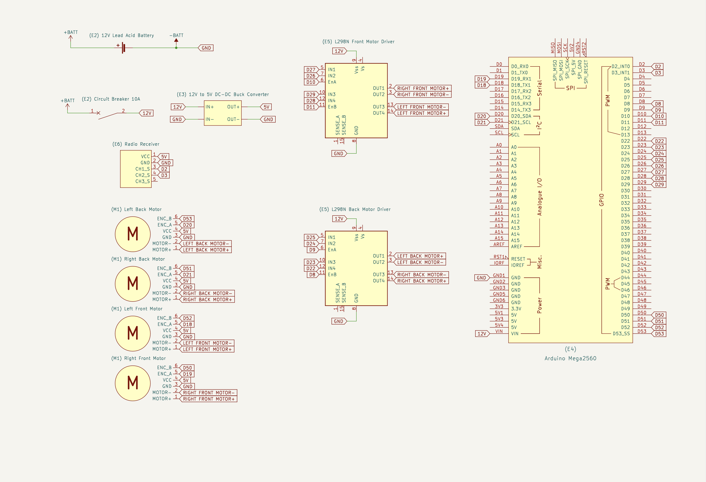
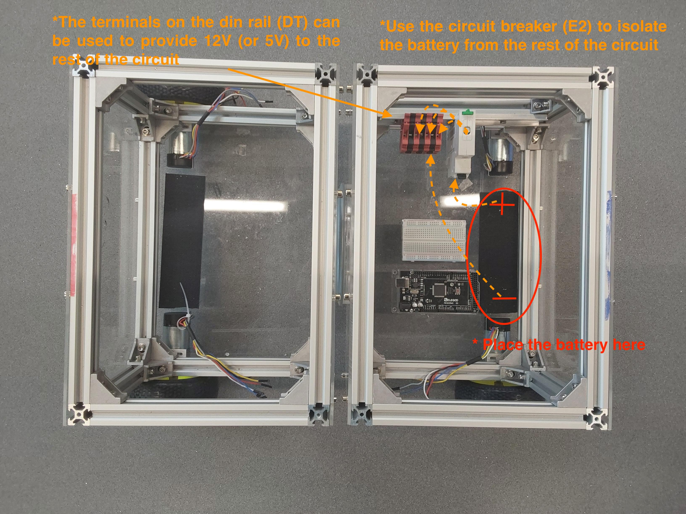
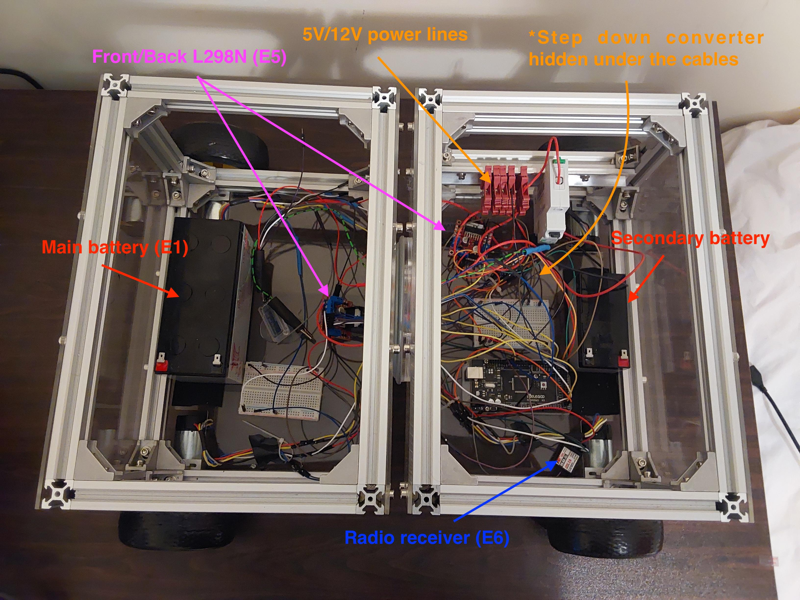

# Electronics layout

## Build time = 75 minutes

### Bill of materials:

| Material                         | Quantity | Reference | UK link |
| ---------------------------------|---------:|:---------:|:-------:|
| 12V Lead Acid battery | 1 | E1 | [Link](https://uk.rs-online.com/web/p/lead-acid-batteries/0597835) |
| 10A circuit breaker | 1 | E2 | [Link](https://amz.run/5TFI) |
| Buck converter | 1 | E3 | [Link](https://amz.run/5TFJ) |
| Arduino Mega | 1 | E4 | [Link](https://amz.run/5TFL) |
| L298N Motor drivers | 2 | E5 | [Link](https://amz.run/5TFN) |
| Radio transmitter-receiver | 1 | E6 | [Link](https://amz.run/5TFO) |
| 90:1 12V motor with encoders | 4 | M1 | [Link](https://amz.run/5TFQ) |
| Din rail with terminal blocks | 1 | DT | [Link](https://amz.run/5TFF) |
| Velcro 50mmx1m | 1 | Q | [Link](https://amz.run/5TFP) |
| Breadboards | - | - | - |
| Wires | - | - | - |

CQrobot Motor (M1) pinout:
| Motor (M1) | wire |
| -----------|-----:|
| ENC_A  | yellow |
| ENC_B  | white |
| VCC    | blue |
| GND    | gray |
| MOTOR+ | red |
| MOTOR- | black |

## Introduction

This tutorial provides instructions for wiring together the electronic components. Example photos are provided and can be used as reference, however some of the components are optional (e.g. the terminal blocks (DT) on the din rail, and the breadboards) but you are free to replace them with other components such as veroboards, depending on your soldering experience. The schematics provided in `.pdf` format show in-detail how the different components are connected together. (**WARNING**: Please handle the Lead Acid battery (E1) with care.)

## Wiring Diagram

  

## Step-by-step instructions

### 1. Connecting the arduino

1. Attach a strap of velcro (Q) either on the back or the front of the robot (depending on where you'd like to place the battery), and on the bottom of the battery (E1) so you can secure it on the robot. You can use the terminal blocks on the din rail (DT) to prepare some 12V and 5V (using the step down converter (E3)) power lines to power the components.

2. See the [arduino layout](../../Documentation/Schematics/arduino_layout.pdf) schematic for reference.

  

### 2. Attaching the radio receiver

1. Power the radio receiver (E6) using 5V from the step down converter (E3)
2. Connect the ground from the radio receiver (E6)
3. Connect radio receiver (E6) channels on the arduino (E4) as follows:

| radio receiver (E6) | Pin on Arduino |
| -----------------|---------------:|
| CH1_S | D2 |
| CH2_S | D3 |

  

4. See the [radio receiver layout](../../Documentation/Schematics/rc_layout.pdf) schematic for reference.
  

### 3. Connecting the front motors with the front motor driver

1. Connect the L298N front motor driver (E5) on 12V and the enable/input pins on the arduino (E4)

| L298N front motor driver (E5) | Pin on Arduino |
| -----------------|---------------:|
| ENA | D10 |
| IN1 | D27 |
| IN2 | D26 |
| IN3 | D29 |
| IN4 | D28 |
| ENB | D11 |

2. Connect the output pins of the L298N (E5) on the LF and RF motors (M1) (see the motor color table on the top of the page).

| L298N front motor driver (E5) | RF Motor (M1)|
| -----|----:|
| OUT1 | red |
| OUT2 | black |

| L298N front motor driver (E5) | LF Motor (M1)|
| -----|----:|
| OUT3 | black |
| OUT4 | red |

3. Connect the encoder VCC and GND on the LF and RF motors (M1) on the 5V output of the step down converter (E3).
   
4. See the [front side motors layout](../../Documentation/Schematics/front_side_motors.pdf) schematic for reference.

### 4. Connecting the back motors with the back motor driver

1. Connect the L298N back motor driver (E5) on 12V and the enable/input pins on the arduino (E4)

| L298N back motor driver (E5) | Pin on Arduino |
| -----------------|---------------:|
| ENA | D9 |
| IN1 | D25 |
| IN2 | D24 |
| IN3 | D23 |
| IN4 | D22 |
| ENB | D8 |

2. Connect the output pins of the L298N (E5) on the LB and RB motors (M1) (see the motor color table on the top of the page).

| L298N back motor driver (E5) | LB Motor (M1)|
| -----|----:|
| OUT1 | red |
| OUT2 | black |

| L298N back motor driver (E5) | RB Motor (M1)|
| -----|----:|
| OUT3 | black |
| OUT4 | red |

3. Connect the encoder VCC and GND on the LB and RB motors (M1) on the 5V output of the step down converter (E3).
   
4. See the [back side motors layout](../../Documentation/Schematics/back_side_motors.pdf) schematic for reference.

  

## What's next?
Congratulations! The robot wiring is complete. Follow the last part of the tutorial series to [flash the software](../../Software/README.md).
