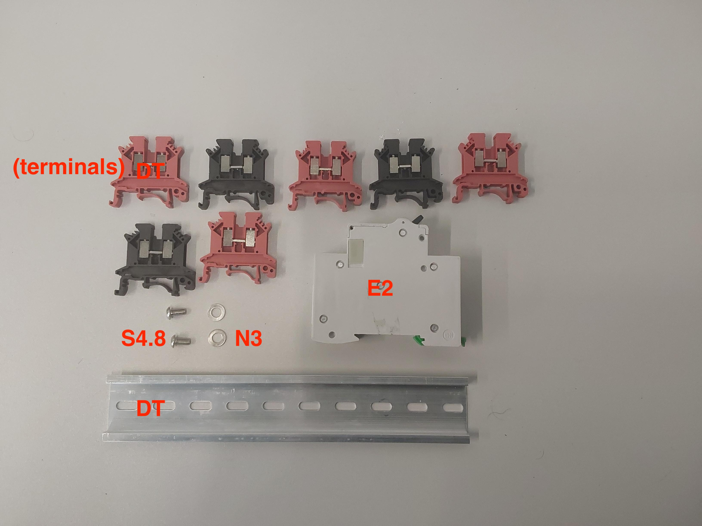
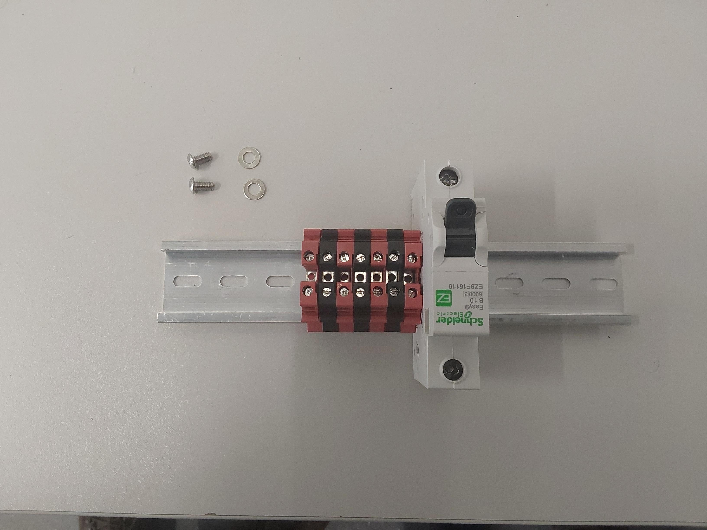
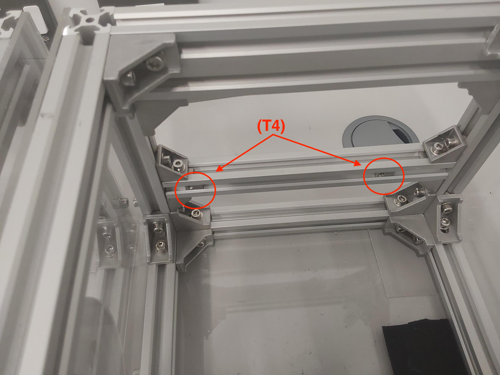
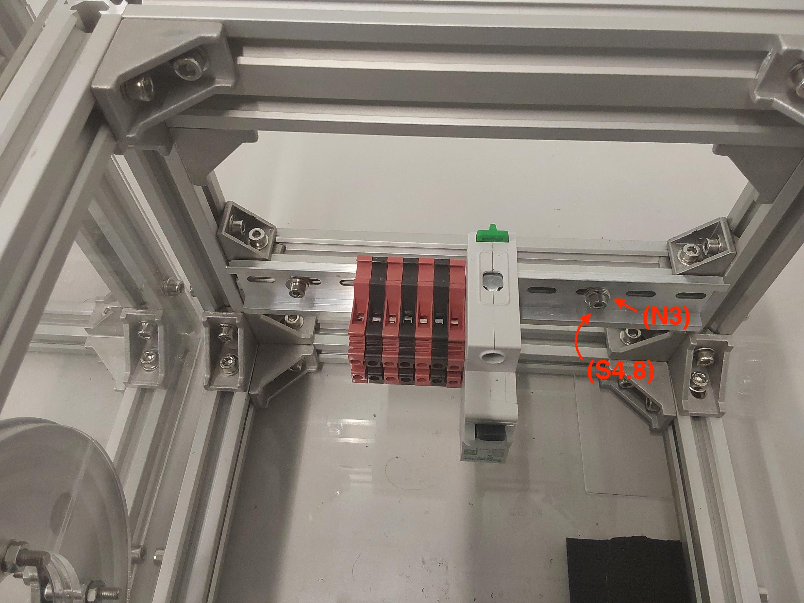

# Din rail

## Build time = 15 minutes

### Bill of materials:

| Material                         | Quantity | Reference | UK link |
| ---------------------------------|---------:|:---------:|:-------:|
| Din rail with terminal blocks | 1 | DT | [Link](https://amz.run/5TFF) |
| Din rail with terminal blocks | 1 | DT | [Link](https://amz.run/5TFF) |
| 10A circuit breaker | 1 | E2 | [Link](https://amz.run/5TFI) |
| M4 8mm socket screw | 2 | S4.8 | - |
| M4 T-slot nuts | 2 | T4 | - |
| M5 Washers | 2 | N3 | - |

## Introduction

The din rail (DT) consists of a holed metal with some terminal blocks (red & white) attached on it. You can attach as many as you wish, and its purpose is provide some convience while wiring the battery.

## Step-by-step instructions

1. Attach the terminal blocks and the circuit breaker (E2) on the (DT). They 'click' if fitted properly, and they freely move along the rail.

  
  

2. Fit in-place 2 (T4) nuts on the extrusion that will accommodate the din rail and screw the rail on them using (N3) washers. Make sure that is properly fitted by giving it a shake.

  
  

## What's next?
Follow the [attaching motors and wheels](./motors_and_wheels.md) tutorial to complete the chassis of the robot.