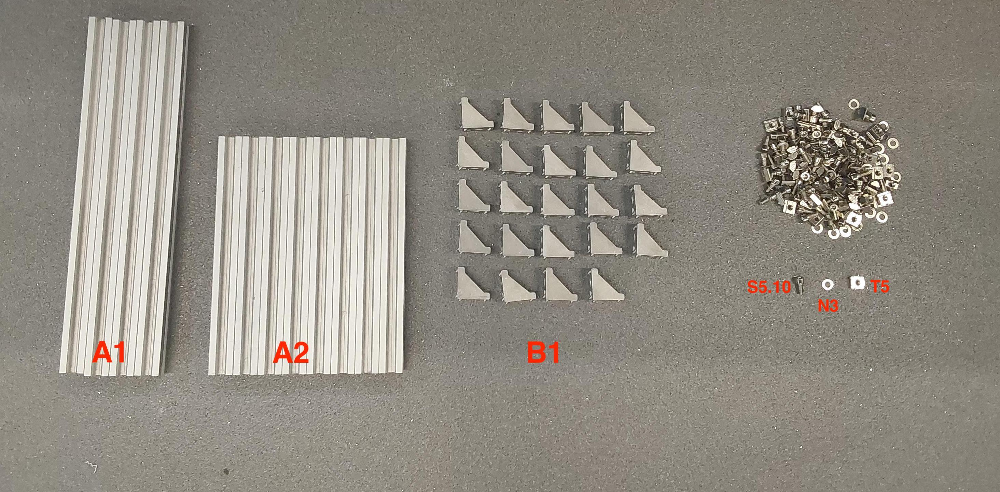
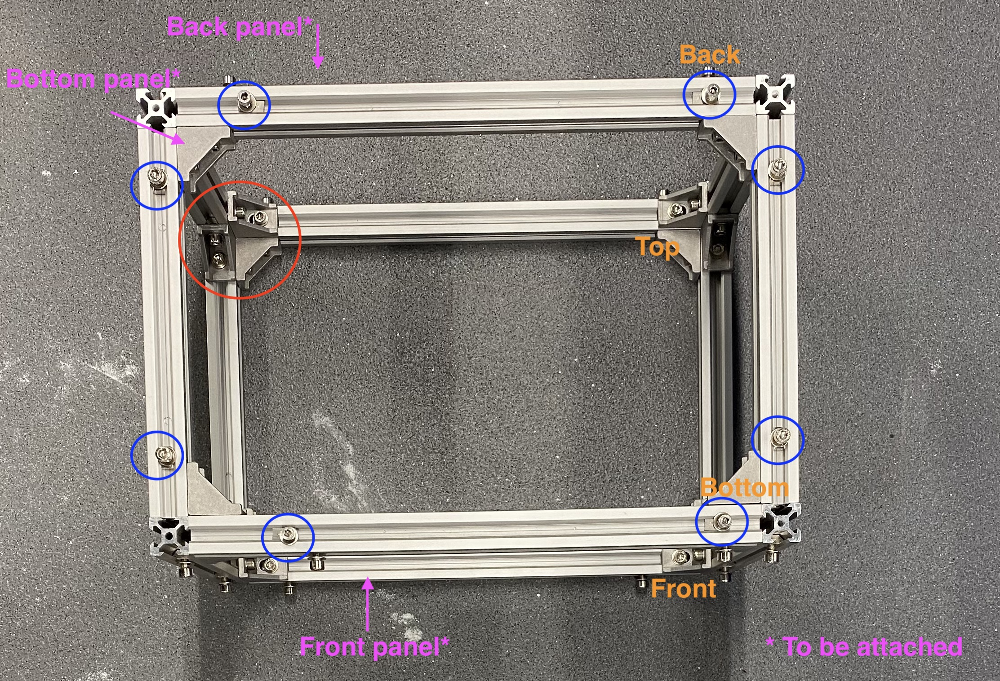
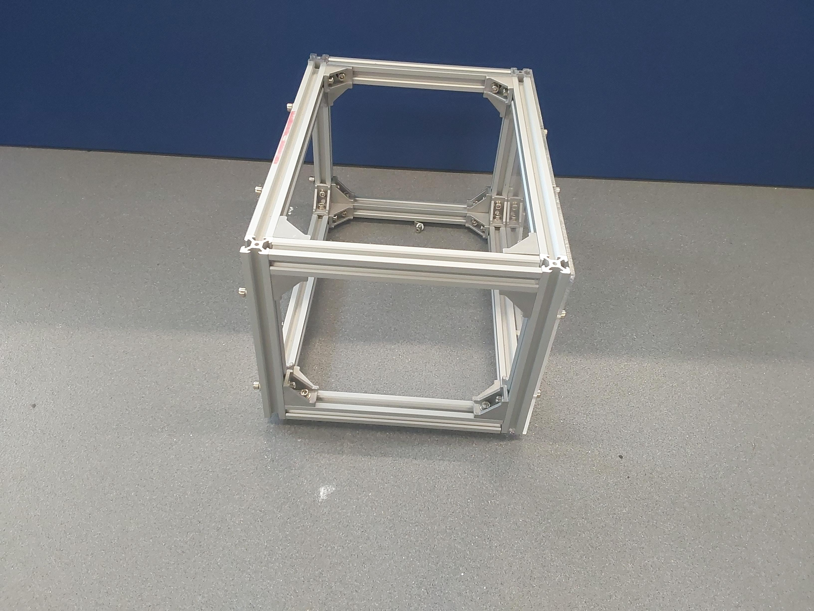
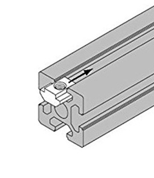
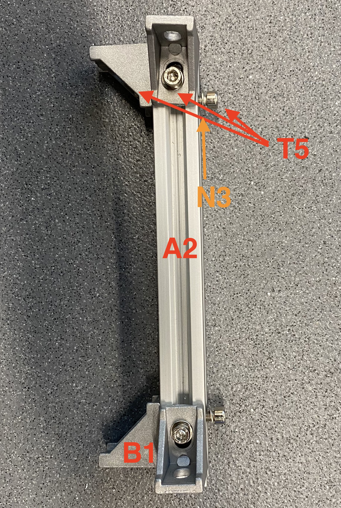
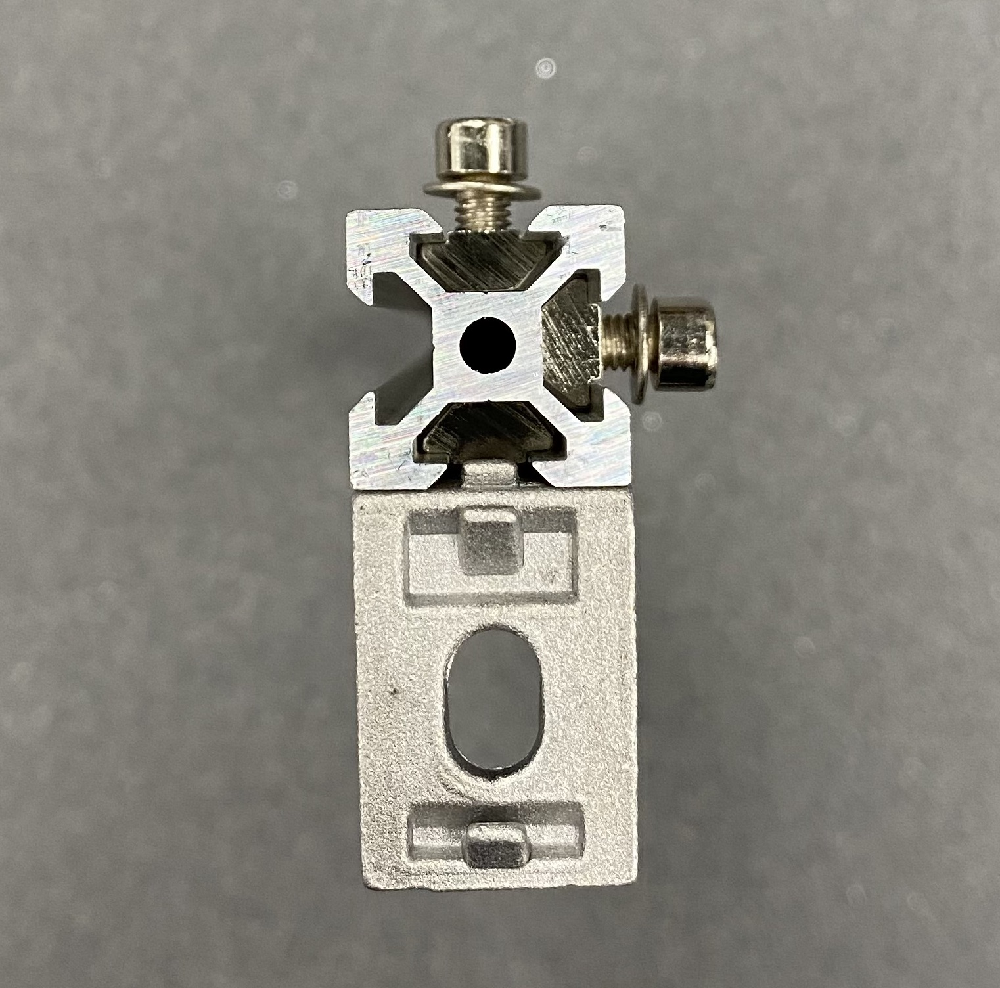
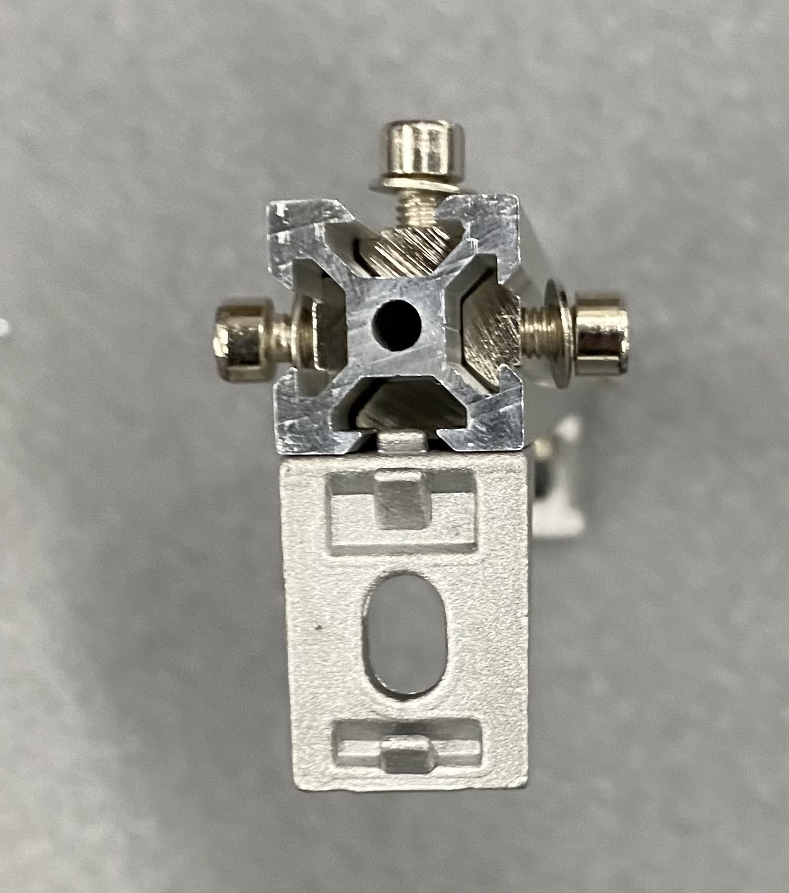
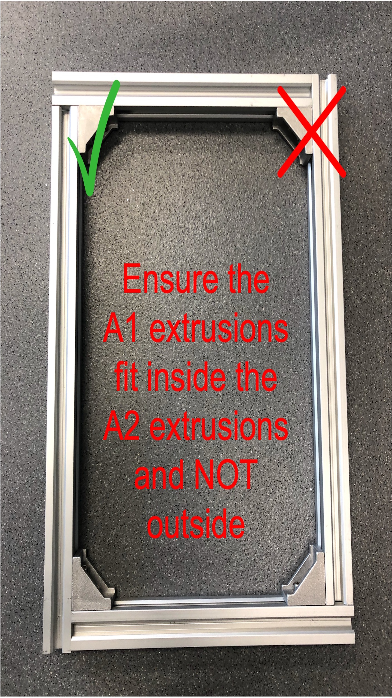

# Front Compartment

## Build time = 75 minutes

### Bill of materials:

| Material                         | Quantity | Reference | UK link |
| ---------------------------------|---------:|:---------:|:-------:|
| 300mm 20x20 aluminium extrusion  | 4 |  A1 | [Link](https://ooznest.co.uk/product/v-slot-linear-rail-20x20mm-cut-to-size/) |
| 200mm 20x20 aluminium extrusion  | 8 | A2 | [Link](https://ooznest.co.uk/product/v-slot-linear-rail-20x20mm-cut-to-size/) |
| 20x20 Angle Joint Brace Brackets | 24 | B1 | [Link](https://amz.run/5TF6) |
| M5 10mm socket screw | 72 | S5.10 | - |
| M5 T-slot nuts | 72 | T5 | - |
| M5 Washers | 72 | N3 | - |

  

## Introduction

The front compartment consists of a boxed-shaped construction made of x4 300mm aluminium extrusions (A1) in horizontal positions (giving width to the box), x4 200mm (A2) extrusions (giving length to the box) and x4 (A2) extrusions vertically attached (giving height to the box). The following image shows how it should look like if completed successfully. Notice how the extrusions are attached together using 3 angle joints (red circle) (B1) on each corner (8 corners in total). Furthemore, the compartment is symmetrical across all 3 major axis. The blue circles indicate bolts which will accommodate the acrylic panels (8 bolts in total in the bottom, front and back sides of the compartment. The top and the left/right sides do not accommodate acrylic panels currently to lower the cost.).

Final result:

  
  

The T-slot nut (T5) is very useful to fasten things on aluminium extrusions as it allows it to freely slide within the extrusion and gets secured once it's fastened with a screw. The order of attachment from bottom to top should be: T-slot nut (T5), attachment, washer (N3) and lastly secured with the bolt (S5.10). **Be careful though that the T-nut to be inserted needs an open ended extrusion, so you need to know how many of them you need before start attaching things to the end of the extrusions.**

## Step-by-step instructions

1. Prepare 4 (A2) extrusions which are going to be used vertically defining the height of the robot. Attach the (B1) joints using the order defined previously: (T5) nut, (B1) joint, (N3) washer, and secure with a (S5.10) socket screw. Each side should have 2 joints attached and a (S5.10) without something attached (these sockets will later accommodate the acrylic panels). Do not tight the screws too much as this is not their final place. Just try to secure them on the aluminium.

  
  

2. Prepare 2 more (A2) extrusions to secure (T5) nuts, (N3) washers and (S5.10) screws; 3 on each side as in the following image. Again, do not over tighten (finger tight is good enough so they don't fall out of the channel), as they are later going to accommodate the bottom acrylic panels, and the (B1) joints we prepared in the previous step.

  
  

3. Prepare 2 off (A2) extrusions and secure using (T5) nuts, (N3) washers and (S5.10) screws; 2 on each side this time. Again, do not over tighten, they are later going to be used as the ones in step 2, but on the top side which will not host any acrylic (hence the 2 instead of 3 screws).

  
  

4. Prepare 2 off (A1) extrusions which are going to be used horizontally (on the top side) defining the width of the robot. See the following image for reference.

  
  

5. Prepare the rest 2 (A1) extrusions which are going to be used horizontally (on the bottom side) defining the width of the robot. See the following image for reference. In contrast with step 4, each side has 3 (S5.10) screws, as the extra one is going to secure the bottom panel.

  
  
  

6. To assemble the front side frame, you need to attach together 2 pieces from step 1, and with one piece from step 4. and one piece from step 5. See the following image for reference. To attach them together you will need to unscrew some screws to attach the (B1) on the piece, and untight some others to align them. Be careful while untightening as the (T5) nuts might fall off the extrusion. You can now fully tighten the properly aligned (S5.10) screws, as this is their final position. Repeat the step to form the back side of the frame.

  
  
  

7. Connect the two frames together using the extrusions we prepared in step 2. and in step 3. The pieces prepared in step 2 (with the extra (S5.10) screws), should be on the same side with the pieces prepared in step 5. as they will accommodate the acrylic panel and they should be 8 in total. Make sure to tight the screws after aligning the frame.

  

If everything was followed correctly, the box should look as the reference image in the beginning of the page. If not, don't worry, everything can be fixed with in-place adjustments.

(**HINT**: It might be hard remembering which screws has been tightened and which not. Marking them with a sharpie or with a bit of tape after tightening them might help.)

## What's next?
Follow the [back compartment](./back_compartment.md) tutorial for the back side of the robot.