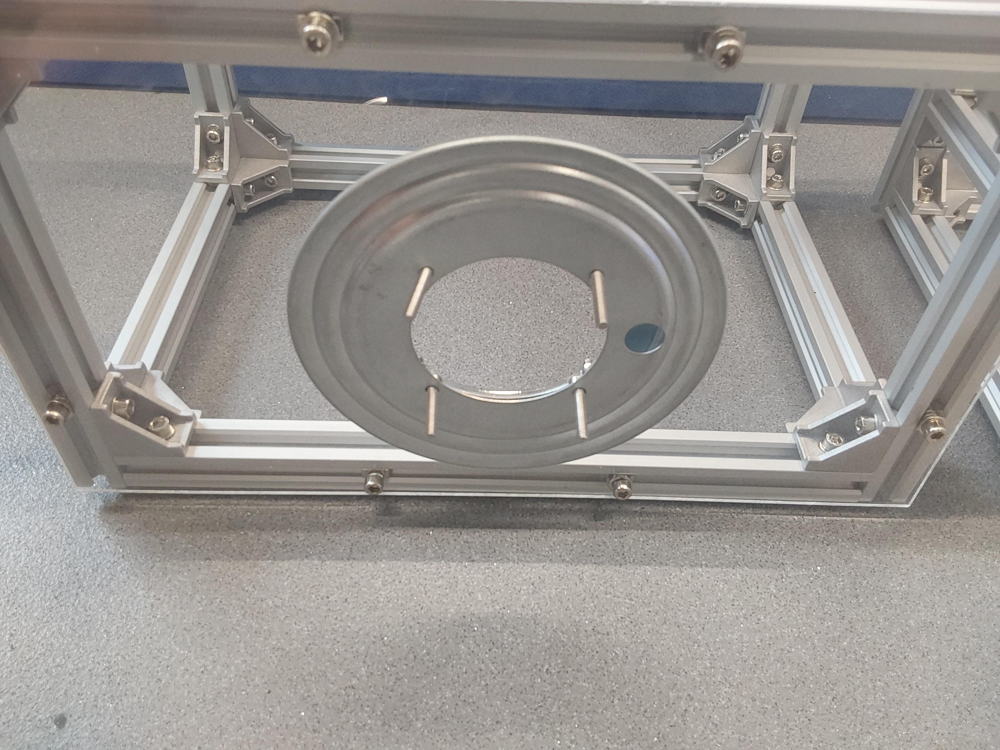

# Adding the Lazy Susan hinge

## Build time = 45 minutes

### Bill of materials:

| Material                         | Quantity | Reference | UK link |
| ---------------------------------|---------:|:---------:|:-------:|
| 200x340x3mm  acrylic sheet | 2 | C1 | [Link](https://www.acrylicsheetcuttosize.co.uk/product/clear-acrylic-sheet/) |
| Spacers from acrylic leftovers | 2 | C2.1 | [Link](https://www.acrylicsheetcuttosize.co.uk/product/clear-acrylic-sheet/) |
| Lazy Susan 5.5in | 1 | LS | [Link](https://amz.run/5TF8) |
| M4 12mm socket screw (More info needed) | 4 | S4.12 | - |
| M4 16mm socket screw (More info needed) | 4 | S4.16  | - |
| M4 Hex nuts | 8 | N1 | - |
| M5 Washers | 8 | N3 | - |

Note: The (C2.1) components have been cut using leftovers from the 3mm acrylic sheet.

## Introduction

This tutorial includes instructions to connect the front and the back compartments using the hinge.

## Step-by-step instructions

1. TODO:
 - how to laser-cut the middle panels..
 - Upload the .dxf files in the `./cad_files` folder
 - Update the `./cad_files/README.md`

2. Fit the acrylic panel with the bigger hole in back side of the front compartment (the front and the back sides of the compartment are symmetrical), using the pre-fitted (S5.10) screws. Next, fit the acrylic panel with the smaller hole on the front side of the back compartment (the din-rail should be located on the right side of the back compartment). When tightening, ensure that diametrically apposite nuts are tightened in sequence (like you would a car wheel), to ensure even compression and reduce potential cracking.

  
  

3. Attach the small hole of the hinge (LS) on the front compartment using the (S4.12) screws; The small hole on the hinge will help screw all of them, by rotating it to each hole.

  
  

4. Insert 4 (S4.16) screws on top of 4 (N3) washers on the other side of the lazy susan (LS) and attach the spacers (C2.1) in alternating directions.

  
  

5. Bring the spacers (C2.1) together forming circles and place them on top of each other in alternating directions. See the following image for reference.

  
  
  

6. Finally attach the back compartment and screw the (S4.16) screws using the rest (N1) nuts. Make sure that the compartments can freely move independently.

 

  

## What's next?
Follow the [acrylic panels](./acrylic_panels.md) tutorial to attach the side and bottom panels on the robot.