# Motors and wheels

## Build time = 45 minutes

### Bill of materials:

| Material                         | Quantity | Reference | UK link |
| ---------------------------------|---------:|:---------:|:-------:|
| 90:1 12V motor with encoders | 4 | M1 | [Link](https://amz.run/5TFQ) |
| Wheels (112x46mm) | 4 | M2 | [Link](shorturl.at/cwxR2) |
| Wheel Hex Driver 12mm to 17mm | 4 | M3 | [Link](shorturl.at/axT25) |
| Hex coupler 6mm   | 4 | M4 | [Link](https://amz.run/5TFT) |
| Sems screw 6mm (More info needed) | 16 | P4.6 | - |
| Sems screw 8mm (More info needed) | 8 | P4.8 | - |
| M4 30mm socket screw | 4 | S4.30 | - |
| M4 Hex nuts | 12 | N1 | - |
| M4 Hammer nuts (More info needed)| 8 | N2 | - |
| M5 Washers | 8 | N3 | - |

## Introduction

We used four 12V 90:1 CQrobot motors as they provide a relatively good amount of torque and they come with encoders as well. The particular motors come with brackets, thus mounting them gets very easy.
One the other hand, the wheels selection wasn't very sophisticated, and soon they will replaced by bigger ones in order to increase ground clearence.

## Step-by-step instructions

1. Fit the motor bracket on the slots on the acrylic, by fitting in-place 2 (N2) nuts and (N3) washers using the (P4.8) screws. Ensure that the (N2) nuts are correctly secured in the channel slot. Repeat for the rest of the motors and make sure that the brackets are properly fitted by shaking them.

  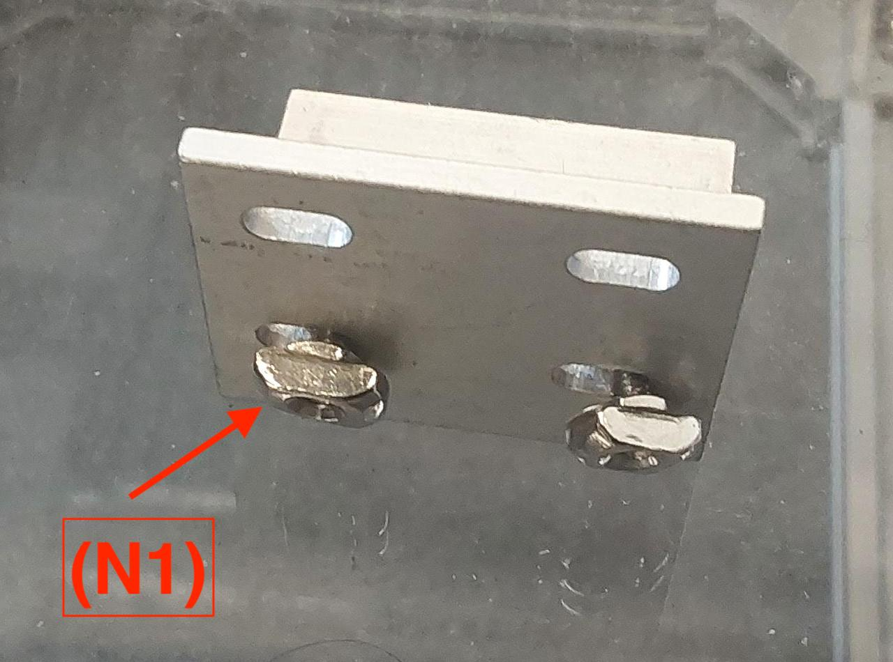
  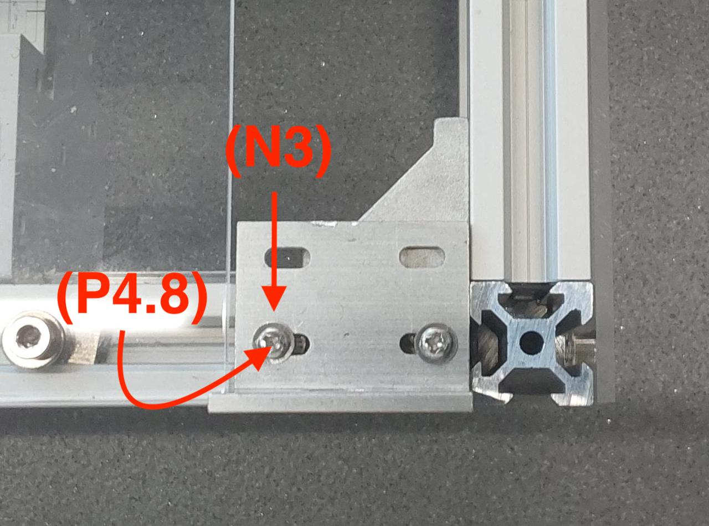
  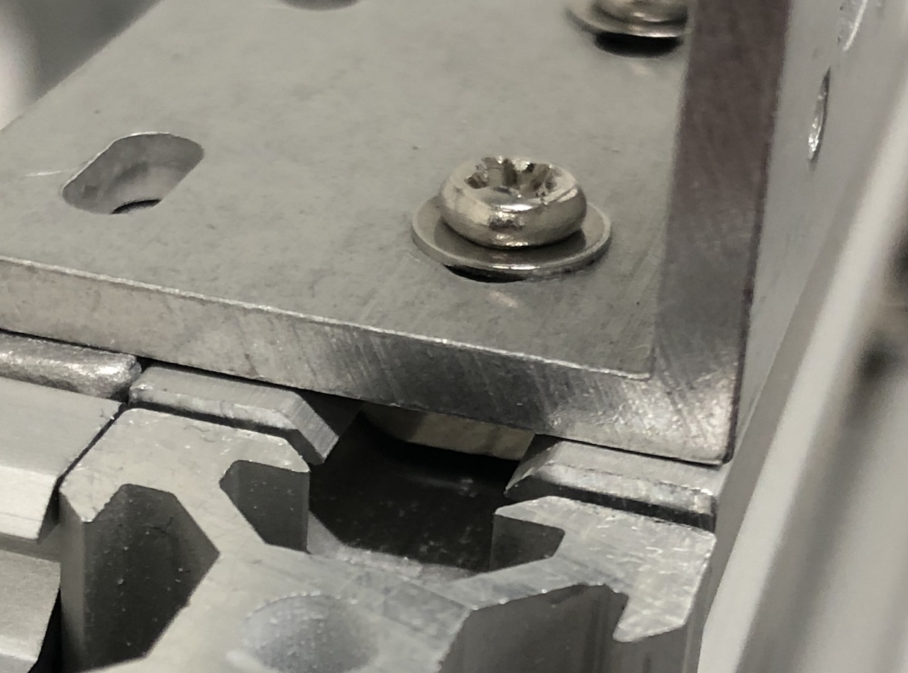

2. Align the (M1) motor on the bracket using the holes as a guide, and attach them using the (P4.6) screws. Repeat for the rest of the motors.

  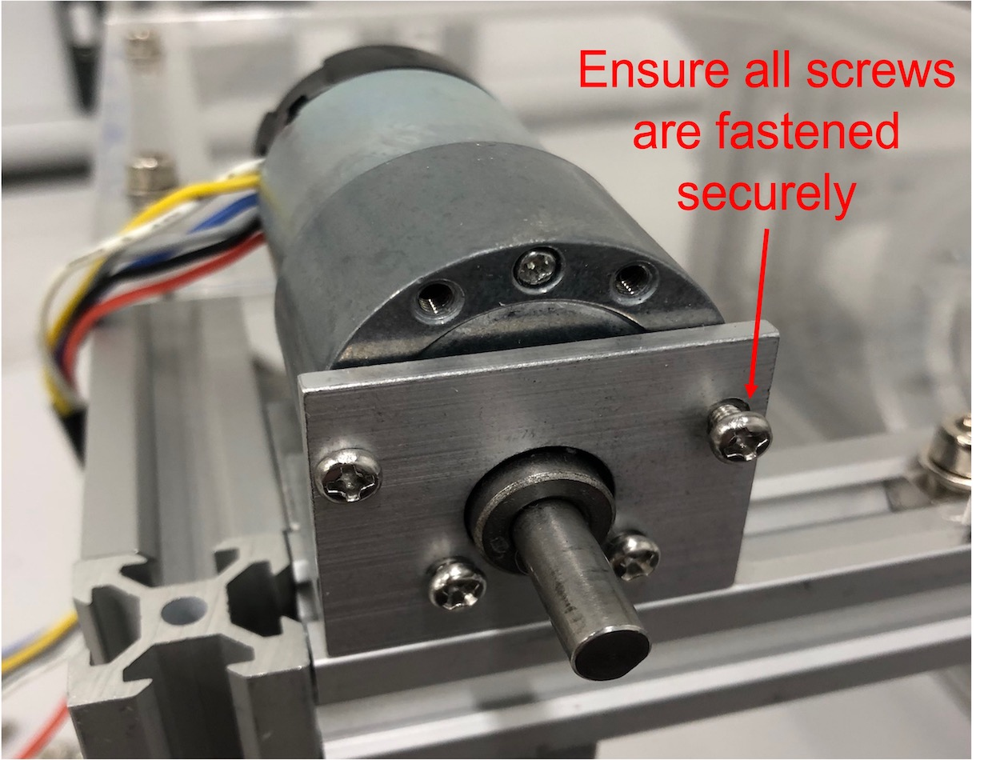
  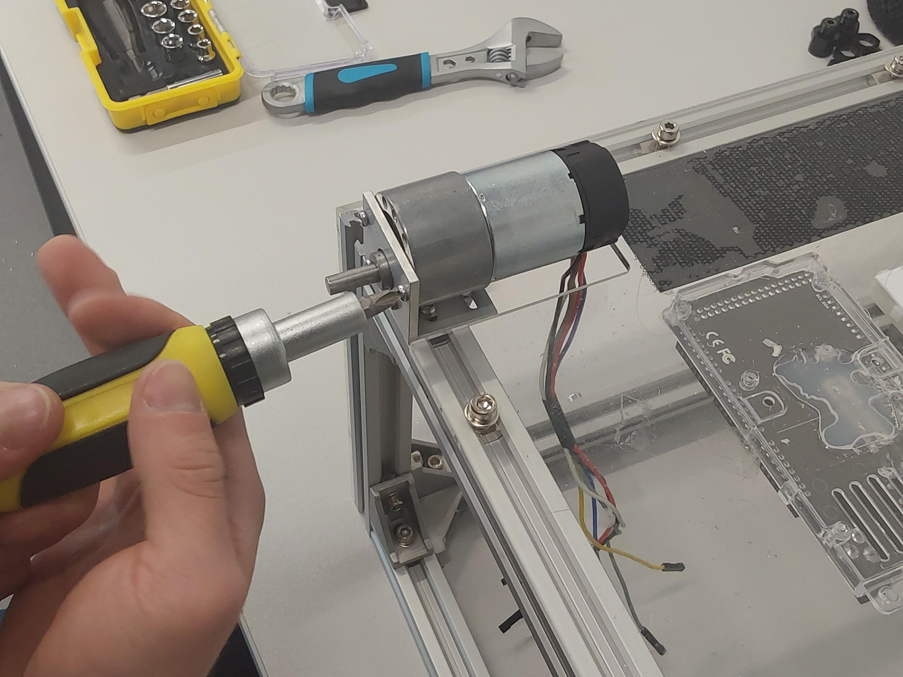
  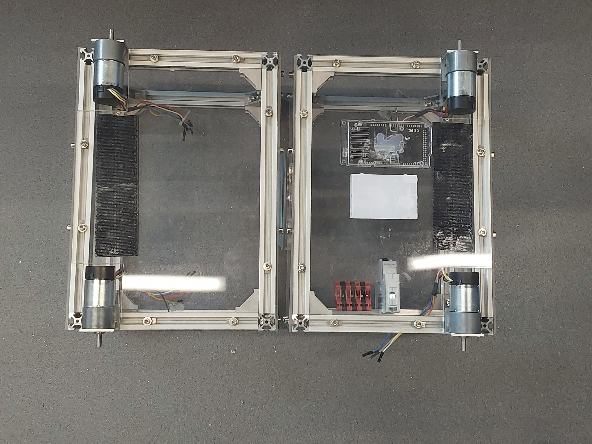

3. Attach the (M4) hex couplers on each motor shaft using the provided screws, and tight them. Ensure that the grub screw is tightened on the flat provided on the motor shaft. Make sure you give enough distance (~10mm) so the wheels won't touch the bracket while driving. Be sure that the hex coupler has been mounted properly by trying to pull it off.

  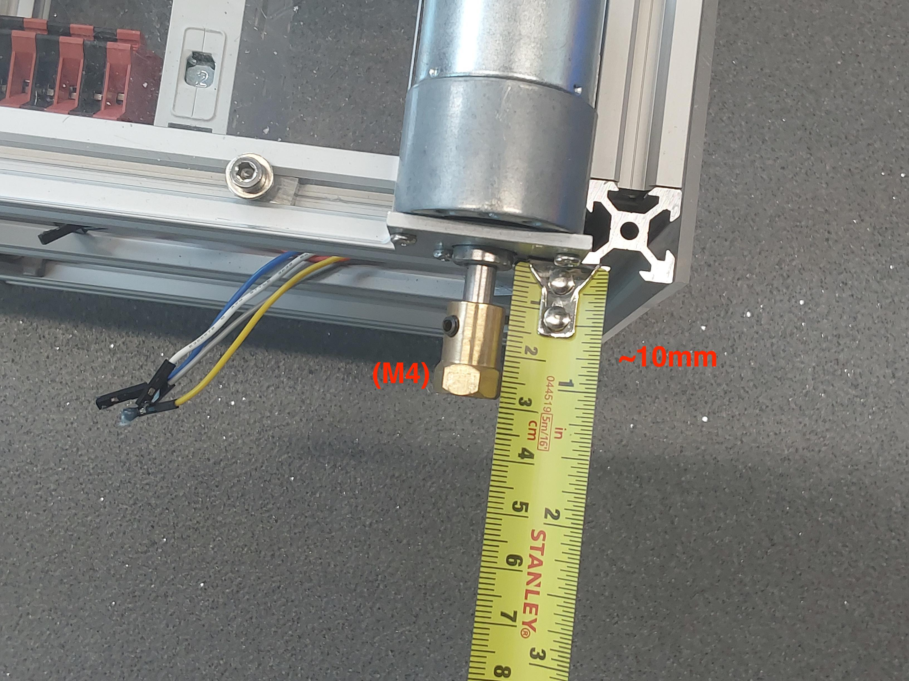
  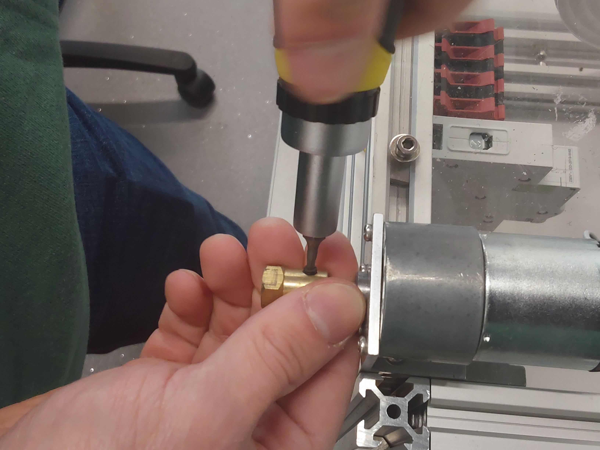
  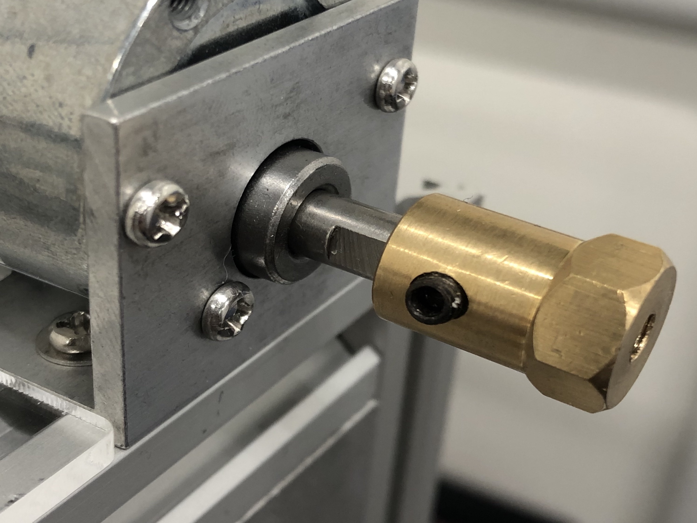

4. Attach the (M3) hex adaptors on each wheel so they can be fitted on the (M4) hex couplers. (**Optional**: If you intend driving the robot on surfaces with high friction, you can tape the wheels avoiding fast wear and tear.)

  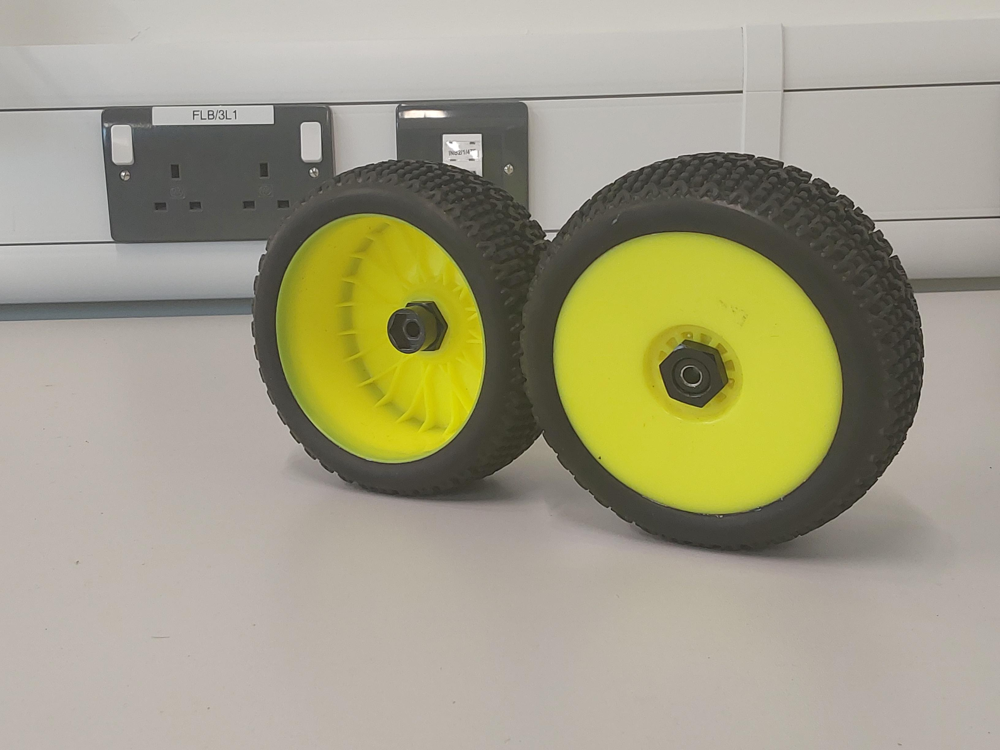
  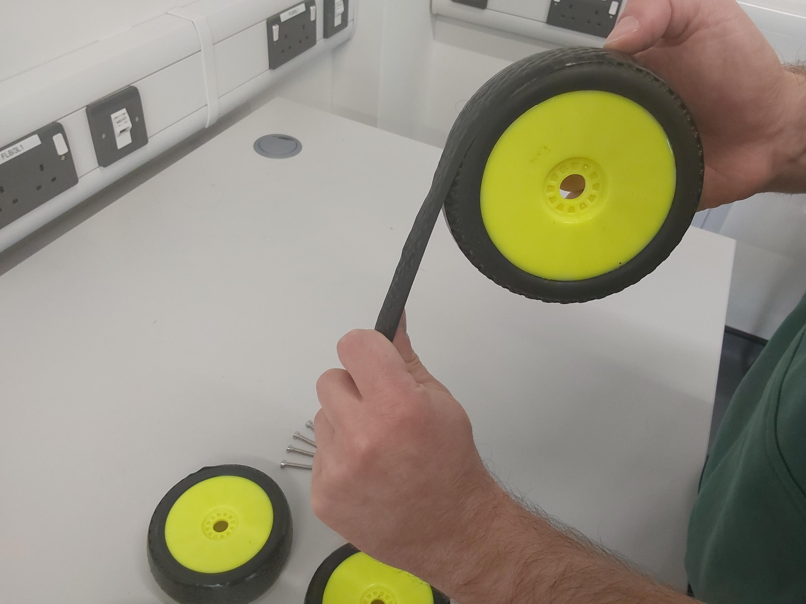

5. Fit the wheels on the shafts using the (S4.30) screws. If the screw does not fully screw on the (M4) hex coupler, use a (N1) hex nut as spacer.

  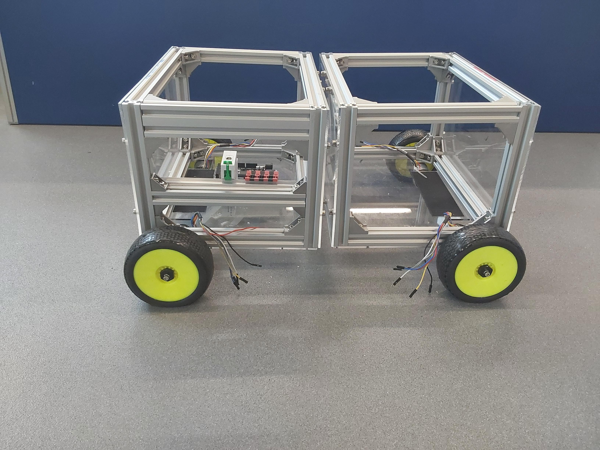

## What's next?
Congratulations! The robot chassis is complete. Follow the [adding the electronics](./circuit_assembly_instructions.md) tutorial to proceed with the wiring.
