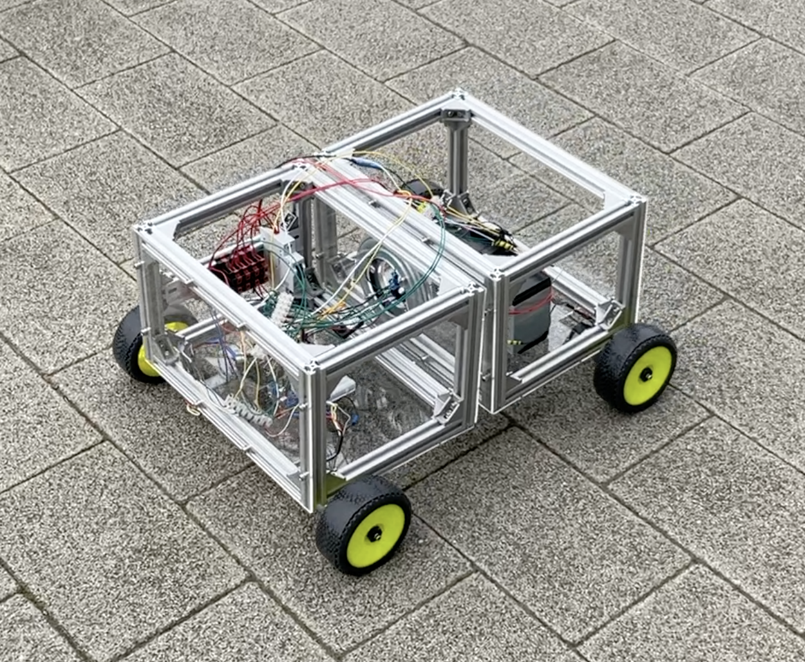
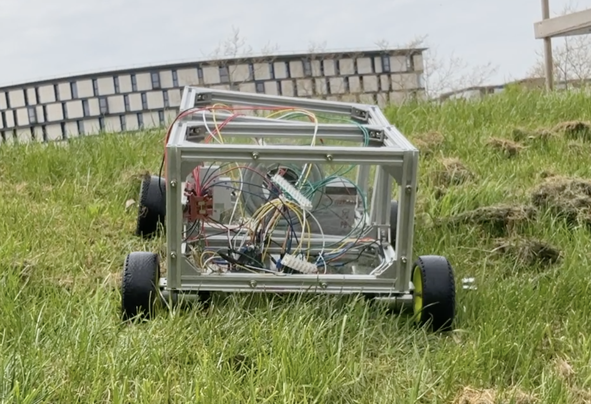
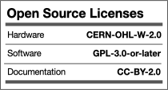

# OpenScout

## An Open Source Hardware Mobile Robot
OpenScout is a low-cost open source hardware and software mobile robot that can be used for both indoor and outdoor tasks, transporting up to 15kg of payload. The robot is designed to be easily and cheaply (350USD) buildable and modifiable by non-specialists, and to function as a new standard physical platform for robotics research and real-world tasks, replacing current proprietary options. Example applications include last mile and factory floor delivery, site survey and monitoring, and agricultural crop operations.

OpenScout is made of standard sizes aluminium extrusions making it very modular. That means its chassis design depends on the use case and the needs of the user. The robot provides the bare minimum (wizard-of-oz tele-operation and software for controlled differential drive) and future versions will introduce more chassis configurations, ROS/ROS2 integration and gazebo urdf files.

<p align="center" width="100%">
    
     
</p>

## Demonstration

Demonstrations showing a variety of different mobility aspects can be found in the [Demonstrations](Demonstrations) directory. The below demonstration shows OpenScout with a 'lazy Susan' revolute hinge successfully traversing uneven terrain with circa 40 mm divots.

https://user-images.githubusercontent.com/44243266/164105180-839fc627-df63-4446-af7d-90f431a007b9.mp4

## HackaDay
This project was covered in a [Hackaday article](https://hackaday.com/2022/09/26/robotic-platform-is-open-sourced-and-user-friendly/) by Bryan Cockfield, noting OpenScout as a straightforward and easy build without many specialized tools; providing a really useful platform to expand upon.

## Getting started
Materials used:
The robot consists of 200mm & 300mm 20x20 aluminium extrusions connected with 90 degree angle joints so the width, length and its height can be highly adjustable. We suggest also the [90:1 12V CQrobot](https://www.amazon.co.uk/CQRobot-90-Gearmotor-oz-Diameter/dp/B0887RR8SH) motor with encoder, as 4 of them provide enough traction to carry big payloads. Finally, an Arduino Mega is necessary as it provides enough interrupt pins for the RF receiver and the motor encoders.

The full bill of materials depends on each configuration and for more details please refer to the tutorials.

## Assembly Tutorial:

A fully documented assembly tutorial for the OpenScout with a 'Lazy Susan' revolute hinge is available below. Additionally, a comprehensive and fully annotated [Assembly Manual](Documentation/CAD_Files/Instruction_Manual/InstructionManual.pdf) with step by step 3D projections of the hardware build has been made available to print out. All associated CAD files and schematics are available in the [Documentation](Documentation) directory.

[OpenScout robot with 'Lazy Susan' revolute hinge](Hardware/robot_with_lazy_susan_bearing/README.md)


## How to contribute
While we try to keep this project open source you are free to make your own choice of materials and adapt the robot to your needs. However, we kindly request you to stick to the suggested 200mm & 300mm 20x20 aluminum extrusions, to allow other users disassemble their current configuration and try out yours! If you use OpenScout for your project, please open a PR with your configuration and tutorials. 

The general process of contributing on GitHub is widely documented however the outline process is below:

1. Identify where you want to host the project locally. This could be a OpenScout projects folder for example. 


1. Clone or fork the repository using GitHub desktop or the CLI into this location (CLI is recommended as this helps you become more familiar with Git in general). You can do this with the following command:

    ```bash
    git clone https://github.com/cbedio/OpenScout
    ```

1. Update the project and then make a pull request!

## License

This project is licensed under the [GNU General Public License v3.0](LICENSE) and [CERN-OHL-W](LICENCE) and [CC BY-SA](CC-BY-SA_LICENCE)

<p align="left" width="100%">
    
</p>

